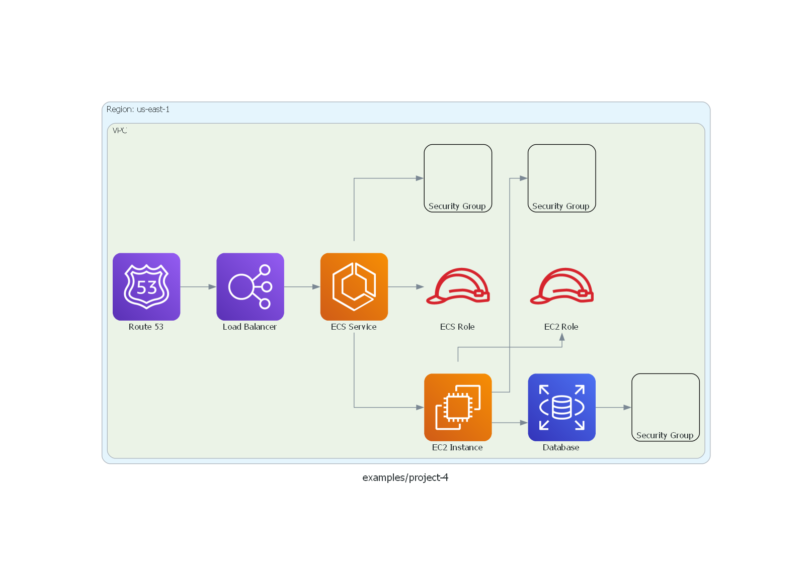
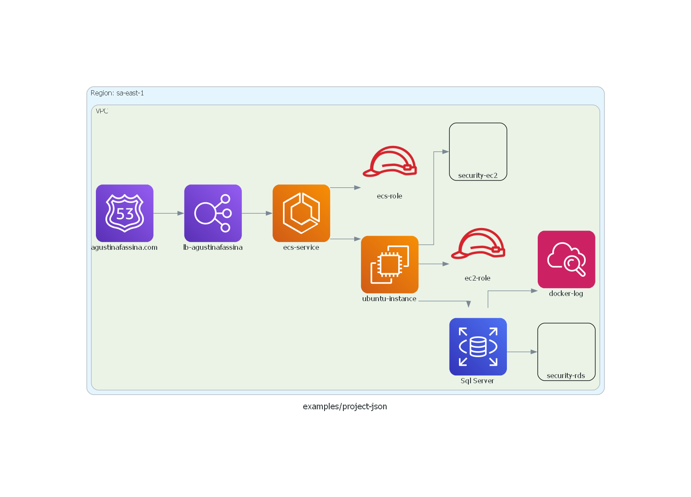
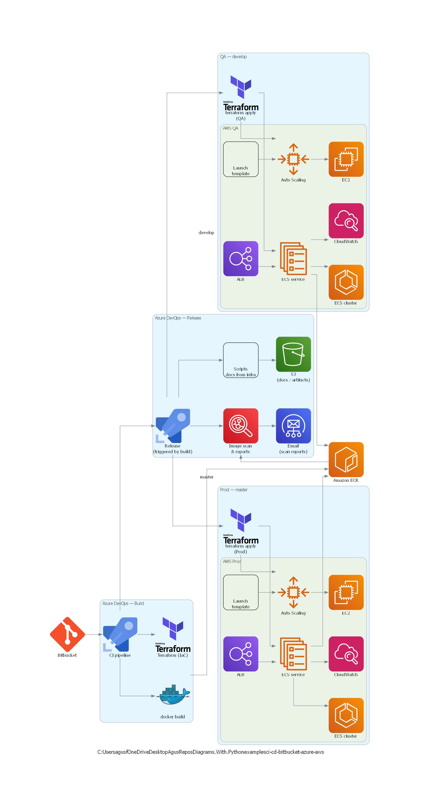
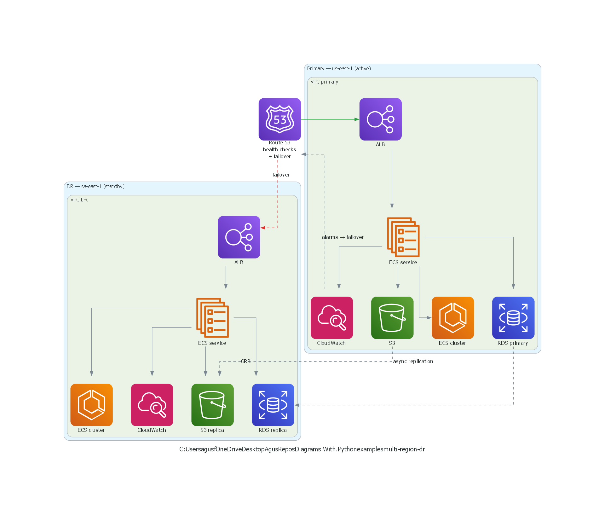

# Diagrams with Python

**[English](#english)** · **[Español](#español)**

---

## English

Collection of infrastructure diagrams built as code with [Diagrams](https://diagrams.mingrammer.com/) (Python). The idea is to keep visuals reproducible and aligned with what you define in tools like Terraform, so documentation stays clear and easy to refresh.

### Diagram examples

<div align="left">
    
    
</div>
<div align="left">
    
    
</div>

### Repository layout

```text
Diagrams.With.Python/
├── requirements.txt
├── LICENSE
├── examples/                         # Shared PNG gallery
├── samples/                          # Small AWS topologies + JSON-driven diagram
├── ci-cd/                            # Bitbucket → Azure DevOps → AWS (QA / Prod)
├── multi-region-dr/                  # Route 53 failover across two regions
├── landing-zone/                     # Organizations, SSO, SCPs, accounts
├── networking-vpc/                   # Public/private subnets, NAT, ALB, ECS
├── observability/                    # CloudWatch, X-Ray, SNS, SES
├── secrets-config/                   # Secrets Manager + SSM → ECS tasks
├── public-api/                       # API Gateway + WAF + Cognito + ECS/Lambda
├── data-pipeline/                    # S3 → Glue/Lambda → Athena / Redshift
├── gitops-terraform/                 # Bitbucket → pipeline → S3 state + DynamoDB lock
├── diagram-terra/                    # Larger AWS / Azure DevOps style diagram
├── big-diagram/                      # Extended gateway topology
├── ec2-backup-with-s3/               # EC2 → S3 backup
├── ecs-fargate/                      # ECS Fargate
└── with-docker/                      # Docker-related diagram
```

| Folder | Script | Output |
|--------|--------|--------|
| `samples/` | `project-4.py` | `examples/project-4.png` |
| `samples/` | `json-read.py` | `examples/project-json.png` |
| `ci-cd/` | `ci-cd-bitbucket-azure-aws.py` | `examples/ci-cd-bitbucket-azure-aws.png` |
| `multi-region-dr/` | `route53-failover.py` | `examples/multi-region-dr.png` |
| `landing-zone/` | `organizations.py` | `examples/landing-zone.png` |
| `networking-vpc/` | `vpc-public-private.py` | `examples/networking-vpc.png` |
| `observability/` | `cloudwatch-xray.py` | `examples/observability.png` |
| `secrets-config/` | `secrets-manager-ssm.py` | `examples/secrets-config.png` |
| `public-api/` | `api-gateway-waf-cognito.py` | `examples/public-api.png` |
| `data-pipeline/` | `s3-glue-athena.py` | `examples/data-pipeline.png` |
| `gitops-terraform/` | `bitbucket-tf-state.py` | `examples/gitops-terraform.png` |
| `diagram-terra/` | `diagram-terra.py` | `examples/diagram-terra.png` |
| `big-diagram/` | `with-gateway.py` | `big-diagram/with-gateway-diagram.png` |
| `ec2-backup-with-s3/` | `backup.py` | `ec2-backup-with-s3/backup.png` |
| `ecs-fargate/` | `fargate.py` | `ecs-fargate/diagram.png` |
| `with-docker/` | `with-dockers.py` | `with-docker/with-dockers-diagram.png` |

### Prerequisites

- Python 3.x  
- [Graphviz](https://graphviz.org/download/) installed on the system (required by Diagrams). On Windows, the installer often leaves `dot` off your `PATH`; add `C:\Program Files\Graphviz\bin` to the user **PATH** and open a new terminal, or run once per session in PowerShell: `$env:Path = "C:\Program Files\Graphviz\bin;" + $env:Path`  
- Python dependencies (pinned in `requirements.txt`):

```bash
python -m venv .venv
# Windows: .venv\Scripts\activate
# macOS / Linux: source .venv/bin/activate
pip install -r requirements.txt
```

### How to run

Scripts resolve config and output paths from their own location, so you can run them from any working directory:

```bash
python samples/project-4.py
# Writes: examples/project-4.png

python ci-cd/ci-cd-bitbucket-azure-aws.py
# Writes: examples/ci-cd-bitbucket-azure-aws.png
```

Besides the PNG, Diagrams may leave a **Graphviz source file** next to it (same base name, often without a `.dot` extension). You can delete those files and regenerate them by running the script again.

### Tips

- In `Diagram(...)`, `show=True` opens the image with the default viewer after generation; use `show=False` to only write the file.
- Getting started and layout options: [Diagrams — Getting started](https://diagrams.mingrammer.com/docs/getting-started/installation). AWS node catalog: [AWS nodes](https://diagrams.mingrammer.com/docs/nodes/aws).

**Version:** 0.2.0

### License
Released under the [MIT License](LICENSE). Copyright (c) 2026 Agustina Fassina.

---

## Español
Conjunto de diagramas de infraestructura definidos como código con [Diagrams](https://diagrams.mingrammer.com/) en Python. El objetivo es que los gráficos sean reproducibles y coherentes con lo que definís en Terraform (u otras fuentes), para documentar de forma clara y actualizable.

### Ejemplos de diagramas
<div align="left">
    
    
</div>
<div align="left">
    
    
</div>

### Estructura del repositorio

```text
Diagrams.With.Python/
├── requirements.txt
├── LICENSE
├── examples/                         # Galería PNG compartida
├── samples/                          # Topologías AWS pequeñas + diagrama desde JSON
├── ci-cd/                            # Bitbucket → Azure DevOps → AWS (QA / Prod)
├── multi-region-dr/                  # Failover Route 53 entre dos regiones
├── landing-zone/                     # Organizations, SSO, SCPs, cuentas
├── networking-vpc/                   # Subnets public/private, NAT, ALB, ECS
├── observability/                    # CloudWatch, X-Ray, SNS, SES
├── secrets-config/                   # Secrets Manager + SSM → tareas ECS
├── public-api/                       # API Gateway + WAF + Cognito + ECS/Lambda
├── data-pipeline/                    # S3 → Glue/Lambda → Athena / Redshift
├── gitops-terraform/                 # Bitbucket → pipeline → state S3 + lock DynamoDB
├── diagram-terra/                    # Diagrama amplio AWS / Azure DevOps
├── big-diagram/                      # Topología con gateway
├── ec2-backup-with-s3/               # Backup EC2 → S3
├── ecs-fargate/                      # ECS Fargate
└── with-docker/                      # Diagrama con Docker
```

| Carpeta | Script | Salida |
|---------|--------|--------|
| `samples/` | `project-4.py` | `examples/project-4.png` |
| `samples/` | `json-read.py` | `examples/project-json.png` |
| `ci-cd/` | `ci-cd-bitbucket-azure-aws.py` | `examples/ci-cd-bitbucket-azure-aws.png` |
| `multi-region-dr/` | `route53-failover.py` | `examples/multi-region-dr.png` |
| `landing-zone/` | `organizations.py` | `examples/landing-zone.png` |
| `networking-vpc/` | `vpc-public-private.py` | `examples/networking-vpc.png` |
| `observability/` | `cloudwatch-xray.py` | `examples/observability.png` |
| `secrets-config/` | `secrets-manager-ssm.py` | `examples/secrets-config.png` |
| `public-api/` | `api-gateway-waf-cognito.py` | `examples/public-api.png` |
| `data-pipeline/` | `s3-glue-athena.py` | `examples/data-pipeline.png` |
| `gitops-terraform/` | `bitbucket-tf-state.py` | `examples/gitops-terraform.png` |
| `diagram-terra/` | `diagram-terra.py` | `examples/diagram-terra.png` |
| `big-diagram/` | `with-gateway.py` | `big-diagram/with-gateway-diagram.png` |
| `ec2-backup-with-s3/` | `backup.py` | `ec2-backup-with-s3/backup.png` |
| `ecs-fargate/` | `fargate.py` | `ecs-fargate/diagram.png` |
| `with-docker/` | `with-dockers.py` | `with-docker/with-dockers-diagram.png` |

### Requisitos

- Python 3.x  
- [Graphviz](https://graphviz.org/download/) instalado en el sistema (lo exige la librería Diagrams). En Windows, si aparece `ExecutableNotFound: failed to execute WindowsPath('dot')`, agregá `C:\Program Files\Graphviz\bin` al **PATH** del usuario y abrí una terminal nueva, o en PowerShell por sesión: `$env:Path = "C:\Program Files\Graphviz\bin;" + $env:Path`  
- Dependencias de Python (versiones fijadas en `requirements.txt`):

```bash
python -m venv .venv
# Windows: .venv\Scripts\activate
# macOS / Linux: source .venv/bin/activate
pip install -r requirements.txt
```

### Cómo ejecutar

Los scripts resuelven config y salidas desde su propia ubicación, así que podés ejecutarlos desde cualquier directorio de trabajo:

```bash
python samples/project-4.py
# Genera: examples/project-4.png

python ci-cd/ci-cd-bitbucket-azure-aws.py
# Genera: examples/ci-cd-bitbucket-azure-aws.png
```

Además del PNG, Diagrams puede dejar el **fuente Graphviz** al lado (mismo nombre, a veces sin extensión `.dot`). Podés borrarlo y regenerarlo volviendo a ejecutar el script.

### Comentarios y recomendaciones

- En `Diagram(...)`, `show=True` abre la imagen con el visor predeterminado al terminar; con `show=False` solo se guarda el archivo.
- Intro e instalación: [Diagrams — Getting started](https://diagrams.mingrammer.com/docs/getting-started/installation). Catálogo de nodos AWS: [AWS nodes](https://diagrams.mingrammer.com/docs/nodes/aws).

**Versión:** 0.2.0

### Licencia

Publicado bajo la [licencia MIT](LICENSE). Copyright (c) 2026 Agustina Fassina.
